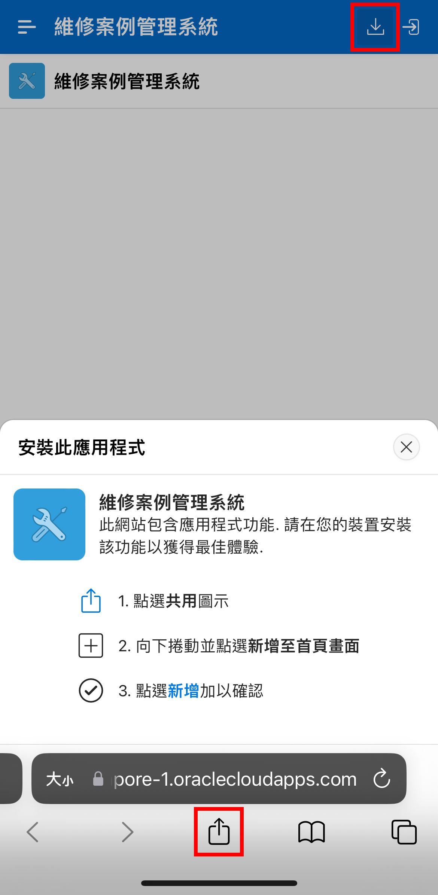
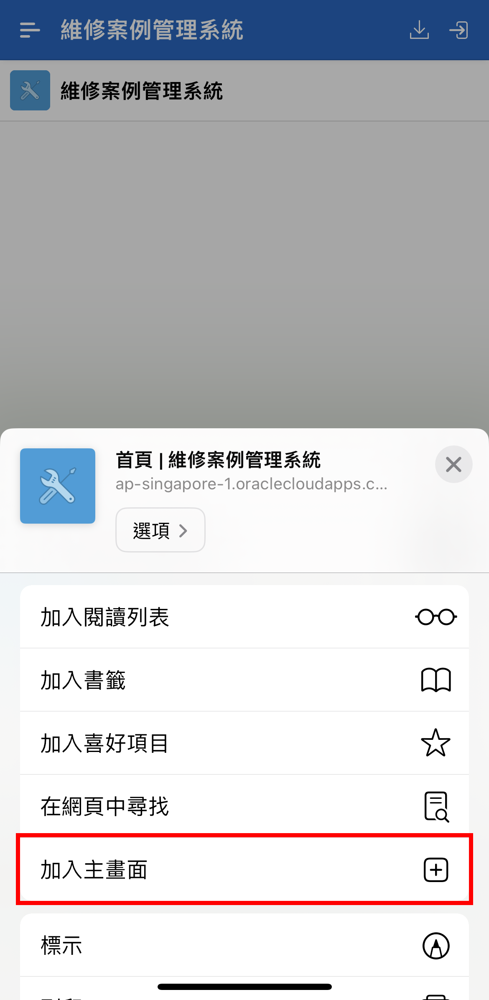
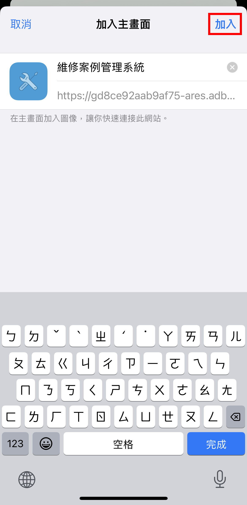

# 安裝應用程式

#### 安裝操作 - IOS 

使用 Safari 瀏覽器進入 [維修案例管理系統](https://gd8ce92aab9af75-ares.adb.ap-singapore-1.oraclecloudapps.com/ords/r/ares/machinery-service-management-system104/home) 並點擊瀏覽器工具列中的「共用」按鈕。

在「共用」選單中，點擊「加入主畫面」。

點擊「加入」按鈕後，將會新增應用程式圖示至首頁畫面上。

透過首頁畫面上的圖示，即可直接開啟維修案例管理系統。
