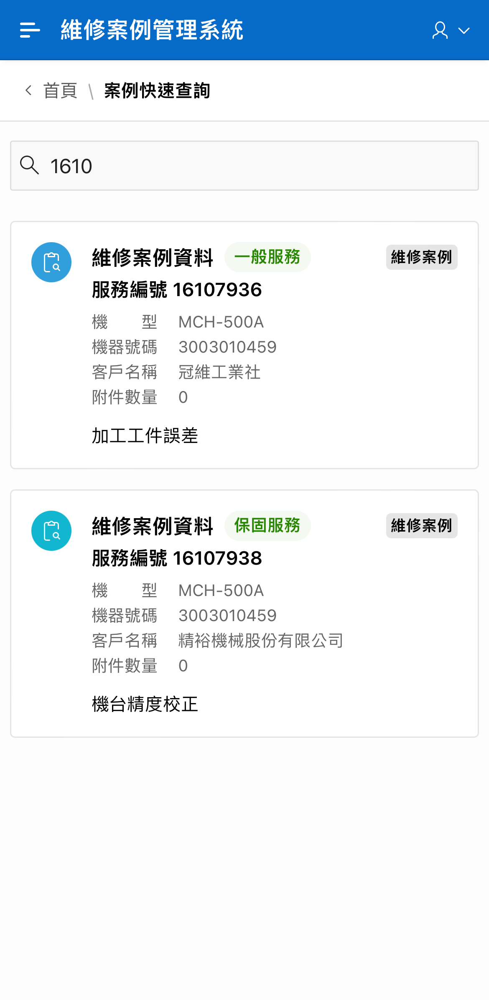
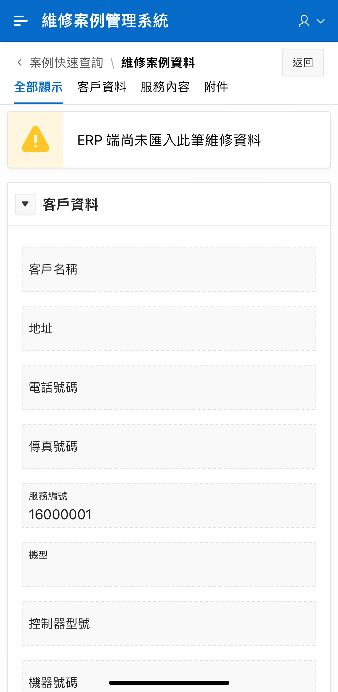
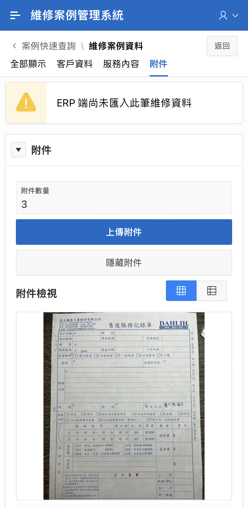

# 查詢案例

## 功能概述 

透過 [快速查詢](https://gd8ce92aab9af75-ares.adb.ap-singapore-1.oraclecloudapps.com/ords/r/ares/machinery-service-management-system104/%E6%A1%88%E4%BE%8B%E5%BF%AB%E9%80%9F%E6%9F%A5%E8%A9%A2-main) 頁面，能使用關鍵字（如：服務編號、PLC 錯誤代碼）同時查詢多個欄位，快速搜尋維修案件或相關案件。

目前關鍵字所能查詢的欄位包含：\
**客戶名稱、機型、機器號碼、控制器型號、服務編號、服務類別、說明、服務內容、問題、原因、解決方式**

在搜尋結果中，可以預覽客戶、機台、附件數量與服務內容說明等資訊。

點擊搜尋結果，能夠進一步檢視該維修案例的詳情與附件。

倘若維修案例資料 **已有附件上傳，但尚未匯入 ERP 系統有關該案例的資料**，則搜尋結果中的服務類別顯示為尚未匯入，在案例詳情中，部分欄位空白且僅能查看已上傳的附件。

## 操作說明 

### 查詢案件 

在 Search Box 輸入查詢資料可同時搜尋多個欄位，包括：\
**客戶名稱、機型、機器號碼、控制器型號、服務編號、服務類別、說明、服務內容、問題、原因、解決方式**

若只有上傳案件的照片但該案件尚未從 ERP 系統端匯入，系統會註記 "尚未匯入" 標籤。

### 查看案件詳細內容 

點選搜㝷結果中的案件可以查看詳細資料：

### 查看案件的上傳附件 

點選「附件」可查看上傳的附件。

## 涵蓋需求 

R02 維修人員查詢案例時能看到照片或錄影，以便更快速的了解案例的狀況。

R03 維修人員查詢時，輸入關鍵字，能同時查詢多個欄位。

* 這些欄位包括：客戶名稱、機型、機器號碼(序號)、服務類別、說明、控制器型號、服務內容、問題、原因、解決方式(代碼)

R05 維修人員能使用 PLC 錯誤代碼找出相關的維修案例。
