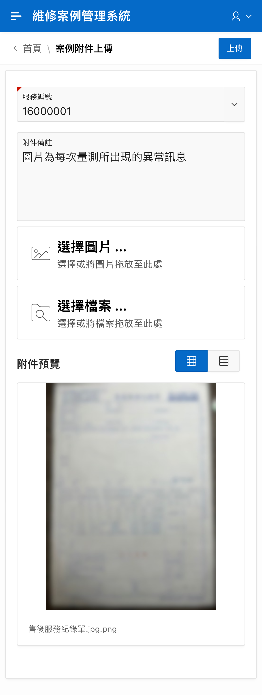
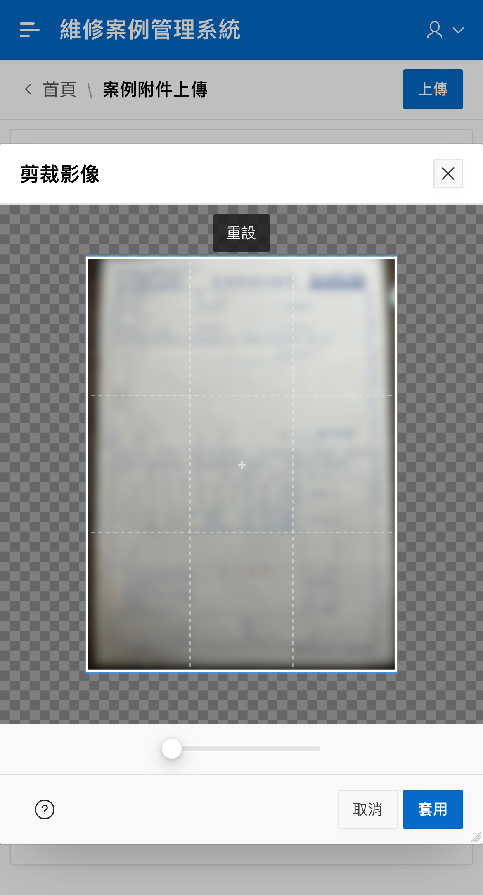
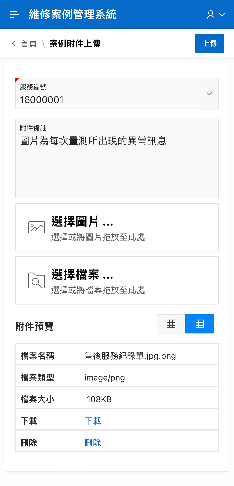

# 上傳附件

## 功能概述 

可於系統的 [案例附件上傳](https://gd8ce92aab9af75-ares.adb.ap-singapore-1.oraclecloudapps.com/ords/r/ares/machinery-service-management-system104/%E6%A1%88%E4%BE%8B%E9%99%84%E4%BB%B6%E4%B8%8A%E5%82%B3-main) 頁面上傳附件，記錄重要的畫面或影像，以協助故障診斷。

手動填入或從清單挑選「服務編號」後，點擊「選擇檔案」按鈕上傳附件，點擊右上方 「上傳」按鈕，確認送出並新增至維修案例中，頁面會跳轉至 [快速查詢](https://machinery-service-management.gitbook.io/index/service-manage/query-find#kuai-su-cha-xun) 頁面並帶入上傳所輸入的服務編號。

供維修人員可於「附件備註」欄位，註記上傳的內容，供日後使用。

頁面提供「圖片式預覽 / 表格式預覽」兩種方式。右側「附件預覽」按鈕可切換不同預覽方式。要對附件進行 刪除 / 下載，需要切換到「表格預覽」。

## 操作說明 

### 上傳附件 

於「服務編號」欄位手動輸入服務編號，或從中選擇從 ERP 匯入的服務編號。

可於「附件備註」註記本次上傳內容。

點選「選擇檔案」，可選擇多張附件。

選擇完畢後，會在「附件預覽」中顯示。

### 切換到「表格式預覽」 

點選「附件預覽」右側的按鈕，可以切換到「表格式預覽」。

點選右上方「上傳」按鈕上傳到系統。系統顯示完成訊息，並轉跳到「查詢案件」頁面。

## 涵蓋需求 

R01 維修人員能針對某個案例使用手機上傳照片或錄影以便對個案做更完整的描述與記錄。
